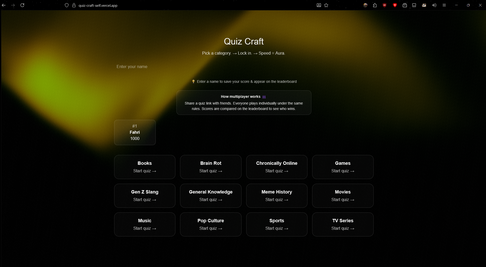
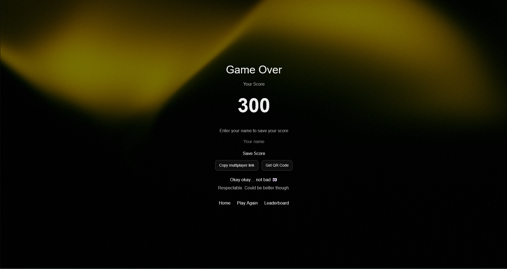
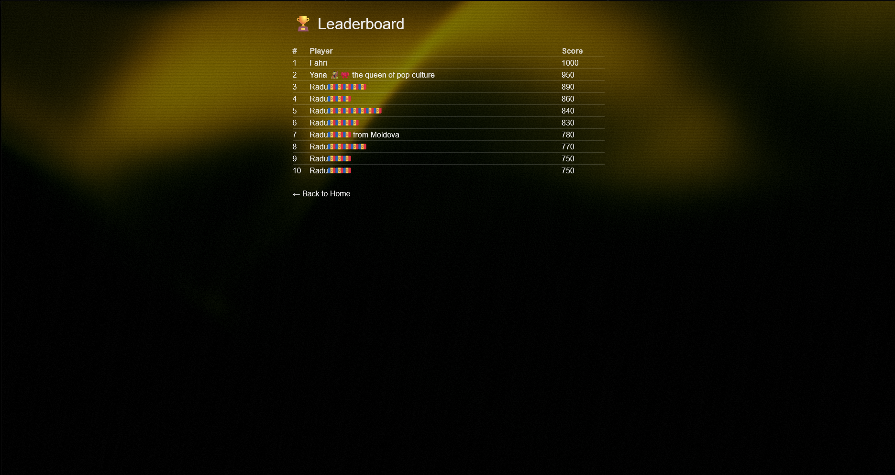
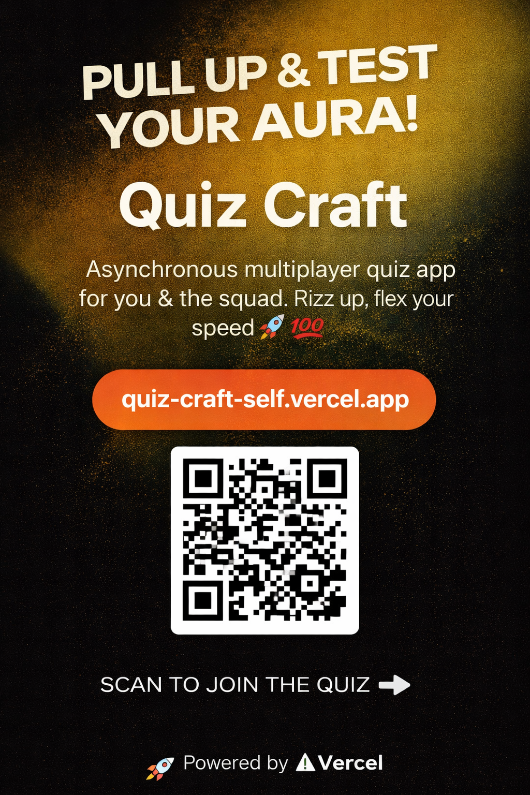

# Quiz Craft 🧠⚡

Quiz Craft is a fast-paced, category-based trivia web application focused on speed, competition, and modern UX.  
Players answer timed questions, earn points based on reaction speed, and compare results via an async multiplayer leaderboard.

🔗 Live demo: https://quiz-craft-self.vercel.app/

---

## 🎯 Project Goal

The goal of Quiz Craft was to design and develop an engaging trivia experience that:
- Feels competitive without requiring real-time multiplayer
- Encourages replayability through scoring and leaderboards
- Targets a Gen-Z audience through tone, visuals, and interaction patterns

The project was built as part of a portfolio assignment with a strong focus on **UX, interaction design, and technical implementation**.

---

## 🧠 Key Features

- **Category-based quizzes**
- **Timed questions with reverse countdown bar**
- **Speed-based scoring system**
- **Async multiplayer**
      - Shareable quiz links
      - QR code support for easy access
- **Leaderboard system (Supabase)**
- **Score-based end screen reactions**
- **Responsive, minimal UI with visual feedback**

---

## 👥 Multiplayer Explained (Async)

Quiz Craft uses **asynchronous multiplayer**, similar to:
- Wordle
- Daily trivia apps
- Duolingo leagues

How it works:
- Everyone plays individually
- Same questions, same rules
- Scores are compared on a shared leaderboard  
No real-time interaction required.

---

## 🛠 Tech Stack

- **Next.js (App Router)**
- **React**
- **TypeScript**
- **Supabase** (database & API)
- **Vercel** (deployment)
- **qrcode.react** (QR code generation)

---

## 🧪 User Testing & Iteration

Based on user and stakeholder feedback:
- Added delay to show correct answers after wrong selections
- Improved score visibility and reactions
- Introduced QR codes for multiplayer access
- Moved leaderboard highlights to the home screen
- Improved clarity around saving scores and multiplayer rules

---

## 🚀 Future Improvements

- Daily challenge mode
- Per-category leaderboards
- Player profiles & streaks
- Animated transitions between questions

---

## 📸 Screenshots

---

## 👤 Author

Created by Fahri Can Genç  
